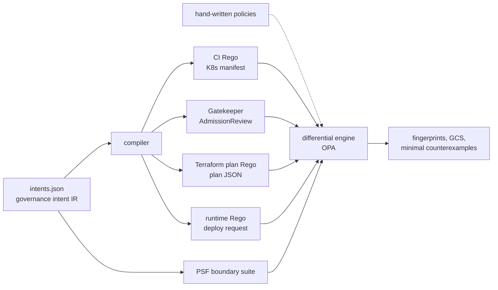

# POLICY SYNAPSE

**Does your policy mean the same thing in CI, at admission, in the Terraform plan and at runtime?**

The same governance rule ("production images must be signed", "confidential data is never public")
is usually implemented four times, in four input formats, by different people. The copies drift.
POLICY SYNAPSE takes one written intent, compiles or checks a Rego policy for every enforcement
surface, and differentially tests each one against the intent with a small, generated boundary suite.
Divergence produces a minimal counterexample and changes the policy's semantic fingerprint.

> v0.1 research prototype. Runs locally with Python and OPA, no cloud account. All benchmark numbers
> are from a synthetic mutation study and are regenerated by the commands below.



## Evidence

**Mutation study** ([`reports/benchmark.md`](reports/benchmark.md)): 20 intents, 67 surface policies,
801 single-predicate drifts (inverted comparison, deleted predicate, case folding, prefix match,
off-by-one, fail-open on absent fields, string vs boolean, wrong field path, extra allowlist value).
89 are semantically equivalent and 4 are rejected by OPA's own type checker; 708 remain.

| How the drift is looked for | Detected | States evaluated per intent (median) |
|---|---|---|
| Example tests: one passing and one failing fixture per policy | 56.9% | 2 |
| Random differential testing, same budget (ablation) | 74.2% | 13 |
| Random differential testing, 10x budget | 93.5% | 130 |
| PSF suite without its scope sweep (ablation) | 71.8% | 8 |
| **PSF boundary suite** | **100%** | 13 |

The reference (unmutated) policies agree with the intents on every state of the exhaustive ground
truth, so none of the methods reports false positives. Example tests catch 0% of fail-open and
prefix-match drift and 6.7% of case-folding drift: the bugs that are easiest to write by hand.

The 100% is **by construction**, not a discovery: for single-predicate drift within the declared
value domains, a suite that makes every predicate decisive at every domain value must see it
(this is MC/DC reasoning). What the study measures is how far the usual alternatives fall short at
the same or larger cost, and which part of the suite matters (the scope sweep is worth 28 points).

**Hand-written case study** ([`reports/drift-case-study.md`](reports/drift-case-study.md)): eight
policies written the way people write them, not generated. Five bugs were caught, one was missed by
design, and both correct policies passed:

| Policy | Result |
|---|---|
| CI: signature annotation compared with boolean `true` (it is the string `"true"`) | caught: signed prod images are denied |
| Runtime: `startswith` on the registry | caught: `acrprod.azurecr.io.evil.io` is allowed |
| Gatekeeper: reads label `environment` instead of `env` | caught: never enforced |
| Terraform: `!= false` on public access | caught: a plan that omits the field passes |
| Terraform: `not location in allowed_regions` | caught: in OPA, `not <absent field> in <set>` does not fire, so a plan without a location passes. The author of this example expected otherwise. |
| Runtime: allowlist gained `uksouth` | **missed**: `uksouth` is outside the declared domain (see limitations) |
| CI replicas, runtime public access | consistent, as they should be |

## Quickstart

Needs Python 3.10+ and [OPA](https://www.openpolicyagent.org/docs/latest/#running-opa) 1.x on `PATH`
(or `OPA_BIN=/path/to/opa`, or the binary in `.tools/`).

```bash
python -m pip install "pytest>=8"
python -m pytest -q
python -m policy_synapse compile --out build          # Rego + Gatekeeper templates for every intent
python -m policy_synapse check build/policies.json    # exit 0: every surface agrees with its intent
python -m policy_synapse check examples/drifted/policies.json --report reports/drift-case-study  # exit 1
python -m policy_synapse bench --out reports          # the mutation study, about 10 s
```

To check your own policies, list them in a manifest with the intent, surface
(`ci | admission | terraform | runtime`), file and decision rule (`deny | violation | allow`), as in
[`examples/drifted/policies.json`](examples/drifted/policies.json). `check` exits 1 on divergence, so
it can gate a pull request.

## How it works

- **Intent IR** ([`intents/intents.json`](intents/intents.json)): scope predicates plus require
  predicates over a canonical workload model. Deny iff in scope and not compliant. A predicate on an
  absent attribute is false (fail closed).
- **Bindings** ([`policy_synapse/model.py`](policy_synapse/model.py)): where each attribute lives on
  each surface, including the awkward parts: annotations are strings, the registry is parsed out of
  the image reference, Terraform attributes sit under `resource_changes[].change.after`, the runtime
  policy is `allow`-shaped rather than `deny`-shaped.
- **PSF boundary suite** ([`policy_synapse/suites.py`](policy_synapse/suites.py)): an in-scope,
  compliant baseline; every referenced attribute swept across its whole domain, including *absent*;
  and an in-scope, violating baseline with every scope attribute swept. Each counterexample differs
  from a baseline in one or two attributes, so no shrinking step is needed.
- **Fingerprint**: a hash of the allow/deny vector over the suite. Equal fingerprints mean agreement
  on the suite, not proven equivalence.
- **Governance Consistency Score**: the criticality-weighted share of suite states on which every
  surface agrees with the intent.
- **Sandboxing**: policies under test are untrusted code; OPA runs without `http.send`,
  `net.lookup_ip_addr` and `opa.runtime` ([threat model](docs/THREAT_MODEL.md)).

## Prior art and what is not new

- MC/DC coverage (avionics testing) and mutation testing of access-control policies (Martin & Xie,
  WWW 2007) are the core ideas here. Change-impact analysis of access-control policies goes back to
  Margrave (Fisler et al., ICSE 2005). SMT-based semantic reasoning over cloud policies is
  production-grade at AWS (Zelkova; Backes et al., FMCAD 2018).
- *Reusing Policy-as-Code Across CI/CD and Kubernetes Admission Control* (MDPI Computers, 2026) shows
  one shared Rego layer can serve Conftest and Gatekeeper with no observed divergence. That settles
  the CI ↔ admission pair when both see the same manifest. This repository targets the surfaces that
  cannot share one module (Terraform plans, runtime requests) and policies that were written
  independently.
- *An Empirical Study of Policy as Code* (MSR 2026) motivates the problem: PaC is concentrated in
  infrastructure and security, with interoperability left open.

The contribution is an engineering one: a working, tested harness that applies these ideas across
four heterogeneous enforcement surfaces behind one intent, with a measured comparison against the
testing people actually do.

## Limitations

- **Declared domains bound what can be seen.** Drift that only matters for values outside an
  attribute's domain (a new region, a new registry) is invisible, as the `uksouth` case shows.
- Single-predicate drift only; interacting faults across predicates are not benchmarked.
- The benchmark's drifts are generated by the same compiler that emits the reference policies. The
  hand-written case study is the check against that circularity, and it is small (8 policies).
- Bindings are hand-written and trusted. A wrong binding hides drift for that attribute.
- Gatekeeper policies are evaluated with OPA against Gatekeeper's input contract, not installed on a
  live cluster. Constraint parameters, Kyverno and cloud-native engines are not covered yet.
- A missing `spec.replicas` means 1 in Kubernetes; the model avoids this by never omitting replicas.
  Defaulting semantics like this are a real source of cross-surface drift the model does not capture.

## Layout

```
intents/intents.json          20 governance intents (the specification)
policy_synapse/model.py       canonical attributes, per-surface bindings, input encoders
policy_synapse/compiler.py    IR -> Rego / Gatekeeper, plus drift mutation operators
policy_synapse/suites.py      PSF boundary suite and the baseline generators
policy_synapse/engine.py      differential check, fingerprints, GCS, reports
policy_synapse/bench.py       mutation study
policy_synapse/opa.py         batched, sandboxed OPA evaluation
examples/drifted/             hand-written policies for the case study
reports/                      generated evidence (JSON + Markdown)
```

## Next (v0.2)

Kyverno and Azure Policy / AWS Config adapters, Gatekeeper constraint parameters, multi-predicate
drift, domain inference from real manifests and plans, and SMT-backed equivalence for a supported
subset of Rego.

MIT licensed.
