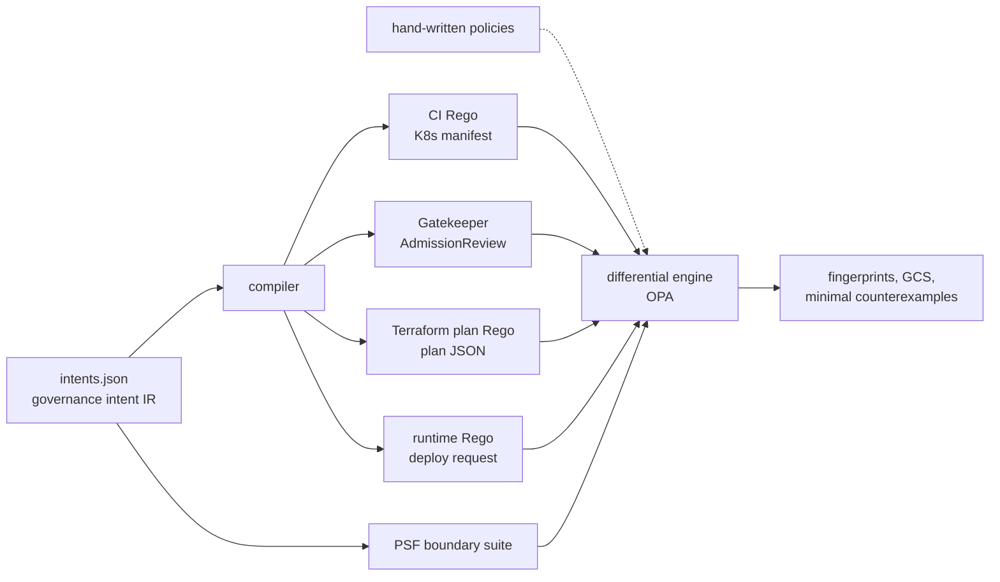

# POLICY SYNAPSE

**Does your policy mean the same thing in CI, at admission, in the Terraform plan and at runtime?**

Test every surface's policy against one written intent with a small, generated boundary suite,
instead of against a couple of hand-picked fixtures per policy.

The same governance rule ("production images must be signed", "confidential data is never public")
is usually implemented four times, in four input formats, by different people, and the copies drift.
POLICY SYNAPSE takes one written intent, compiles or checks a Rego policy for every enforcement
surface, and differentially tests each one against the intent. Divergence produces a minimal
counterexample and changes the policy's semantic fingerprint.

> v0.1 research prototype. Runs locally with Python and OPA, no cloud account. All benchmark numbers
> are from a synthetic mutation study and are regenerated by the commands below.



## Worked example

Intent `prod-approved-registry`: production images come from `prodregistry.example.com`. A hand-written
runtime policy ([`examples/drifted/runtime_prod_registry.rego`](examples/drifted/runtime_prod_registry.rego))
implements it with a prefix match:

```rego
default allow := false

allow if input.workload.env != "prod"

allow if startswith(input.workload.image.registry, "prodregistry.example.com")
```

Checking the case-study manifest (other policies' lines trimmed):

```text
$ python -m policy_synapse check examples/drifted/policies.json
...
DIVERGES  prod-approved-registry [runtime] runtime_prod_registry.rego: 2/14 states, e.g. {'image_registry': 'prodregistry.example.com.evil.io'}
...
GCS 0.917  (divergence found)
```

The command exits 1. Of the 14 suite states, the policy disagrees with the intent on two
([`reports/drift-case-study.json`](reports/drift-case-study.json)):

- `env="prod", image_registry="prodregistry.example.com.evil.io"`: intent deny, policy **allow**
  (a look-alike registry passes the prefix check);
- `env=<absent>, image_registry="ghcr.io"`: intent allow, policy **deny** (in OPA,
  `input.workload.env != "prod"` is undefined when the field is absent, so the out-of-scope rule
  never fires).

Each counterexample is one or two attributes away from the in-scope, compliant baseline, so it
reads as a bug report without a shrinking step.

## Results

**Mutation study** ([`reports/benchmark.md`](reports/benchmark.md)): 20 intents, 67 surface policies,
801 single-predicate drifts. 89 are semantically equivalent on the attribute domains and 4 are
rejected by OPA's type checker; **708** remain.

| Method | Detected | Rate | Median states per intent | Median counterexample size (raw → shrunk) |
|---|---|---|---|---|
| Example tests (1 pass + 1 fail fixture per policy) | 403/708 | 56.9% | 2.0 | 0 → 0 |
| Random differential, same budget as PSF (ablation) | 525/708 | 74.2% | 13.0 | 1 → 1 |
| Random differential, 10x PSF budget | 662/708 | 93.5% | 130.0 | 1.0 → 1.0 |
| PSF without the scope sweep (ablation) | 508/708 | 71.8% | 8.0 | 1.0 → 1.0 |
| **PSF boundary suite (mechanism)** | 708/708 | 100.0% | 13.0 | 1.0 → 1.0 |

The reference (unmutated) policies disagree with the intents on 0 states of the exhaustive ground
truth, so no method can report a false positive on them. Example tests catch 0.0% of `fail_open`
and `prefix` drift and 6.7% of `case_fold` drift: the bugs that are easiest to write by hand. The
scope sweep is worth 28 points (71.8% → 100.0%). Per-operator and per-surface breakdowns are in the
report.

**Hand-written case study** ([`reports/drift-case-study.md`](reports/drift-case-study.md)): eight
policies written the way people write them, not generated. Five bugs were caught, one was missed by
design, and both correct policies passed. GCS **0.917**.

| Policy | Result |
|---|---|
| CI: signature annotation compared with boolean `true` (it is the string `"true"`) | caught: signed prod images are denied |
| Runtime: `startswith` on the registry | caught: `prodregistry.example.com.evil.io` is allowed |
| Gatekeeper: reads label `environment` instead of `env` | caught: never enforced |
| Terraform: `!= false` on public access | caught: a plan that omits the field passes |
| Terraform: `not location in allowed_regions` | caught: in OPA, `not <absent field> in <set>` does not fire, so a plan without a location passes. The author of this example expected otherwise. |
| Runtime: allowlist gained `uksouth` | **missed**: `uksouth` is outside the declared domain |
| CI replicas, runtime public access | consistent, as they should be |

## Quickstart

Needs Python 3.10+ and [OPA](https://www.openpolicyagent.org/docs/latest/#running-opa) 1.x on `PATH`
(or `OPA_BIN=/path/to/opa`, or the binary in `.tools/`).

```bash
python -m pip install "pytest>=8"
python -m pytest -q
python -m policy_synapse compile --out build          # Rego + Gatekeeper templates for every intent
python -m policy_synapse check build/policies.json    # exit 0: every surface agrees with its intent
python -m policy_synapse check examples/drifted/policies.json --report reports/drift-case-study  # exit 1
python -m policy_synapse bench --out reports          # the mutation study, about 10 s
```

To check your own policies, list them in a manifest with the intent, surface
(`ci | admission | terraform | runtime`), file and decision rule (`deny | violation | allow`), as in
[`examples/drifted/policies.json`](examples/drifted/policies.json). `check` exits 1 on divergence, so
it can gate a pull request.

## Mechanism

- **Intent IR** ([`intents/intents.json`](intents/intents.json)): scope predicates plus require
  predicates over a canonical workload model. Deny iff in scope and not compliant. A predicate on an
  absent attribute is false (fail closed).
- **Bindings** ([`policy_synapse/model.py`](policy_synapse/model.py)): where each attribute lives on
  each surface, including the awkward parts: annotations are strings, the registry is parsed out of
  the image reference, Terraform attributes sit under `resource_changes[].change.after`, the runtime
  policy is `allow`-shaped rather than `deny`-shaped.
- **PSF boundary suite** ([`policy_synapse/suites.py`](policy_synapse/suites.py)): an in-scope,
  compliant baseline; every referenced attribute swept across its whole domain, including *absent*;
  and an in-scope, violating baseline with every scope attribute swept. Each counterexample differs
  from a baseline in one or two attributes, so no shrinking step is needed.
- **Fingerprint**: a hash of the allow/deny vector over the suite. Equal fingerprints mean agreement
  on the suite, not proven equivalence.
- **Governance Consistency Score (GCS)**: the criticality-weighted share of suite states on which
  every surface agrees with the intent.
- **Sandboxing**: policies under test are untrusted code; OPA runs without `http.send`,
  `net.lookup_ip_addr` and `opa.runtime`.

## Threat and failure model

The tool runs in CI next to the policies it checks and enforces nothing itself; its output is a
report and an exit code. Intents and bindings are trusted and code-reviewed; policy files under
`check` are untrusted code and are evaluated in a capability-restricted OPA, each in its own
package, with a missing decision rule treated as an error rather than as allow. Reports carry the
commit, command, seed, OPA version and intents hash. Full model: [`docs/THREAT_MODEL.md`](docs/THREAT_MODEL.md).

**Failure taxonomy.** Faults the benchmark and case study cover:

| Class | Where it is exercised |
|---|---|
| Inverted comparison (`negate`), off-by-one bound (`off_by_one`) | mutation study |
| Deleted predicate (`drop`) | mutation study |
| Fail-open on an absent field (`fail_open`) | mutation study; Terraform `!= false` and `not ... in` cases |
| Case-insensitive match (`case_fold`), prefix match / registry spoofing (`prefix`) | mutation study; runtime `startswith` case |
| String vs boolean confusion (`string_bool`) | mutation study; CI signature case |
| Wrong field path (`wrong_path`) | mutation study; Gatekeeper `environment` label case |
| Extra allowlist value inside the domain (`allowlist_extra`) | mutation study |
| Drift OPA's type checker refuses to load | counted separately (4 mutants), not deployable |
| Policy reaching the network or runtime (`http.send`, `net.lookup_ip_addr`, `opa.runtime`) | fails to compile under the capabilities file; `http.send` and `opa.runtime` are tested in `tests/test_opa.py` |

Faults it does not cover: values outside an attribute's declared domain (the `uksouth` miss);
interacting faults across two or more predicates or surfaces; a wrong intent or a wrong binding
(both trusted); platform defaulting semantics such as a missing `spec.replicas` meaning 1;
Gatekeeper constraint parameters and live-cluster behaviour; engines other than OPA (Kyverno, Azure
Policy, AWS Config); tampering with a report after generation (reports are not signed).

## Experiment design

- **Scenarios**: 20 governance intents in [`intents/intents.json`](intents/intents.json), compiled
  to 67 surface policies across CI, Gatekeeper admission, Terraform plan and runtime. Each drift is
  one mutation operator applied to one predicate on one surface (9 operators, 801 variants), plus
  8 hand-written policies in [`examples/drifted/`](examples/drifted/).
- **Ground truth**: the exhaustive product of each intent's attribute domains (including *absent*
  for optional attributes), evaluated with OPA and compared with the IR's decision. A variant that
  agrees with the IR on every state is *equivalent* (89) and excluded; a variant OPA will not compile
  (4) is excluded; the reference policies disagree on 0 states.
- **Baselines**: *naive*: example tests, one passing and one failing fixture per policy, the unit
  test people usually write. *Strong, prior-art-inspired*: random differential testing, uniform over
  the intent's attributes (it knows which attributes matter), at 10x the PSF budget. The shared Rego
  layer approach (MDPI 2026) is compared structurally only, by construction, not measured.
- **Ablations**: random differential testing at the same budget as PSF (is the suite's structure
  what matters, or just its size?), and PSF without the scope sweep (which part of the suite
  matters?).
- **Seed**: one seed, `7`, for the random baselines. PSF and example tests are deterministic.
- **Metrics**: detection rate over the 708 detectable drifts; median suite states per intent (cost);
  median counterexample size, as attributes that differ from the compliant baseline, raw and after
  greedy shrinking; per-operator and per-surface rates; GCS for `check`.
- **Regenerate** (recorded environment: Python 3.10.6, OPA 1.21.0, commit `a9903eb`):

  ```bash
  python -m policy_synapse bench --out reports
  python -m policy_synapse check examples/drifted/policies.json --report reports/drift-case-study
  ```

## What this result does not establish

- **The 100% is by construction, not a discovery.** For single-predicate drift within the declared
  value domains, a suite that makes every predicate decisive at every domain value must see it (MC/DC
  reasoning). The study measures how far the usual alternatives fall short at the same or larger
  cost, not whether PSF finds bugs in general.
- **It does not show PSF catches drift outside the declared domains.** A new region or registry is
  invisible, as the `uksouth` miss shows.
- **It does not cover multi-predicate drift.** Interacting faults across predicates are not
  benchmarked.
- **The mutation study is partly circular.** The drifts are generated by the same compiler that
  emits the reference policies. The hand-written case study is the check against that, and it is
  small (8 policies).
- **The data is synthetic.** No real organisation's policies, manifests or plans were used, and no
  real cloud, cluster or Terraform provider was involved.
- **The random baselines use a single seed (7).** Their rates are not reported with variance.
- **Equal fingerprints are not proof of equivalence**, only agreement on the suite.

## Limitations

- Bindings are hand-written and trusted. A wrong binding hides drift for that attribute.
- Gatekeeper policies are evaluated with OPA against Gatekeeper's input contract, not installed on a
  live cluster. Constraint parameters, Kyverno and cloud-native engines are not covered yet.
- A missing `spec.replicas` means 1 in Kubernetes; the model avoids this by never omitting replicas.
  Defaulting semantics like this are a real source of cross-surface drift the model does not capture.
- Attribute domains are declared by hand and must be widened when the platform adds values.

## Research lineage

- MC/DC coverage (avionics testing) and mutation testing of access-control policies (Martin & Xie,
  WWW 2007) are the core ideas here. Change-impact analysis of access-control policies goes back to
  Margrave (Fisler et al., ICSE 2005). SMT-based semantic reasoning over cloud policies is
  production-grade at AWS (Zelkova; Backes et al., FMCAD 2018).
- *Reusing Policy-as-Code Across CI/CD and Kubernetes Admission Control* (MDPI Computers, 2026) shows
  one shared Rego layer can serve Conftest and Gatekeeper with no observed divergence. That settles
  the CI ↔ admission pair when both see the same manifest. This repository targets the surfaces that
  cannot share one module (Terraform plans, runtime requests) and policies that were written
  independently.
- *An Empirical Study of Policy as Code* (MSR 2026) motivates the problem: PaC is concentrated in
  infrastructure and security, with interoperability left open.

What is not new: the testing ideas above. The contribution is an engineering one: a working, tested
harness that applies them across four heterogeneous enforcement surfaces behind one intent, with a
measured comparison against the testing people actually do.

## Roadmap

v0.2: Kyverno and Azure Policy / AWS Config adapters, Gatekeeper constraint parameters,
multi-predicate drift, domain inference from real manifests and plans, and SMT-backed equivalence
for a supported subset of Rego.

## Layout

```
intents/intents.json          20 governance intents (the specification)
policy_synapse/model.py       canonical attributes, per-surface bindings, input encoders
policy_synapse/compiler.py    IR -> Rego / Gatekeeper, plus drift mutation operators
policy_synapse/suites.py      PSF boundary suite and the baseline generators
policy_synapse/engine.py      differential check, fingerprints, GCS, reports
policy_synapse/bench.py       mutation study
policy_synapse/opa.py         batched, sandboxed OPA evaluation
examples/drifted/             hand-written policies for the case study
reports/                      generated evidence (JSON + Markdown)
```

MIT licensed.
